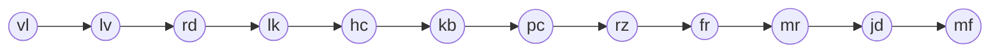
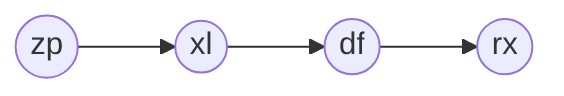

# 2023 Day 20

- [Solution by maneatingape](https://github.com/maneatingape/advent-of-code-rust/blob/main/src/year2023/day20.rs) (Rust)

## Benchmarks (i5-1240P, with parsing, no I/O)

- Part 1: `170.06 µs`
- Part 2: `2.8706 µs`

## Explanation

### Part 1

The button is pressed $n = 1000$ times.\
There are 4 cycles in the graph. Each cycle consists of 12 FlipFlops (FFs) and 1 conjunction. The FFs in each cycle form a binary counter with 12 bits:

= 0000_0000_0000 $\rightarrow$ Max cycle period of $2^{12} = 4096$

#### Pulses to/from Broadcaster

The Broadcaster receives $n$ low pulses and sends $n$ low pulses to each first FF in each cycle.\
$\rightarrow \sum_L = n + 4n = 5000$ (sum of low pulses)

#### Pulses between Counter FFs

| $n$ | Counter |    Pulses | $\sum_{L}$    | $\sum_{H}$ |
| --- | ------- | --------: | ------------- | ---------- |
| 1   | 001     |     H<(L) | $0=n-ones(n)$ | $1=n$      |
| 2   | 010     |   H<L<(L) | $1=n-ones(n)$ | $2=n$      |
| 3   | 011     |     H<(L) | $1=n-ones(n)$ | $3=n$      |
| 4   | 100     | H<L<L<(L) | $3=n-ones(n)$ | $4=n$      |
| 5   | 101     |     H<(L) | $3=n-ones(n)$ | $5=n$      |
| 6   | 110     |   H<L<(L) | $4=n-ones(n)$ | $6=n$      |
| 7   | 111     |     H<(L) | $4=n-ones(n)$ | $7=n$      |

Low pulses from the broadcaster are labeled as (L) and are not counted.

$\rightarrow \sum_L = 4 \cdot (n - ones(n)) = 3976$\
$\rightarrow \sum_H = 4n = 4000$

#### Pulses to cycle conjunctions

$n = 1000 = $ 11_1110_1000 $ \rightarrow$ Counting up to 1000 will only affect the states of 10 FFs.

The number of low/high pulses a FF sends to the conjunction depends on its position in the cycle:

| i-th FF | 1                             | 2   | 3   | 4   | 5   | 6   | 7   | ... |
| ------- | ----------------------------- | --- | --- | --- | --- | --- | --- | --- |
| L       | $\lfloor n/2^i \rfloor = 500$ | 250 | 125 | 62  | 31  | 15  | 7   |
| H       | $round(n/2^i) = 500$          | 250 | 125 | 63  | 31  | 16  | 8   |

$\rightarrow \sum_L = \sum_{i=1..10} \lfloor n/2^i \rfloor = 994$\
$\rightarrow \sum_H = \sum_{i=1..10} round(n/2^i) = 1000$

**BUT:** In each cycle, there are 3 FFs that are not connected to the conjunction

- `zp`:
  - $\sum_L = \sum_{i=1..10\wedge i \not\in [3,4,6]} \lceil n/2^i \rceil = 994 - 202 = 792$
  - $\sum_H = \sum_{i=1..10\wedge i \not\in [3,4,6]} \lceil n/2^i \rceil = 1000 - 204 = 796$
  - $\sum_{zp} = 792 + 796 = 1588$
- `pp`:
  - $\sum_L = 994 - 319 = 675$
  - $\sum_H = 1000 - 321 = 679$
  - $\sum_{pp} = 675 + 679 = 1354$
- `sj`:
  - $\sum_L = 994 - 390 = 604$
  - $\sum_H = 1000 - 391 = 609$
  - $\sum_{sj} = 604 + 609 = 1213$
- `rg`:
  - $\sum_L = 994 - 376 = 618$
  - $\sum_H = 1000 - 377 = 623$
  - $\sum_{rg} = 618 + 623 = 1241$

#### Pulses from cycle conjunctions

A conjuntion only sends a low pulse if the most recent pulses of all connected FFs were high. Because $n=1000$ is smaller than all cycle periods, each cycle conjuction will only send high pulses.

Each cycle conjunction has 4 FFs as outputs. But because it onlys sends high pulses, the FFs will not create any pulses themselves.\
Additionaly, all cycle conjunctions are connected to `rx` via a chain of conjunctions:

The directly connected conjunction (here `xl`) acts like an inverter and `df` will only send high pulses to `rx` (same reason as above):

- `zp`:
  - $\sum_L = \sum_{zp} = 1588$
  - $\sum_H = (4+2)\cdot \sum_{zp} = 9528$
- `pp`:
  - $\sum_L = \sum_{zp} = 1354$
  - $\sum_H = 6\cdot \sum_{pp} = 8124$
- `sj`:
  - $\sum_L = \sum_{zp} = 1213$
  - $\sum_H = 6\cdot \sum_{sj} = 7278$
- `rg`:
  - $\sum_L = \sum_{zp} = 1241$
  - $\sum_H = 6\cdot \sum_{rg} = 7446$

#### Total

$\sum_L = 5000 + 3976 + (792 + 675 + 604 + 618) + (1588 + 1354 + 1213 + 1241) = 17061$\
$\sum_H = 4000 + (796 + 679 + 609 + 623) + (9528 + 8124 + 7278 + 7446) = 39083$

$\rightarrow$ `17061` low pulses and `39083` high pulses in total

### Part 2

`rx` only receives a low pulse when the conjuntions of all cycles send a low pulse in the same button press. Cycle conjunctions only send a low pulse when the cycle finished a period\
$\rightarrow$ We need to find the LCM of all cycle periods

Each cycle has a shorter cycle period than $2^{12}$, because some FFs are not connected to the conjunction\
$\rightarrow$ We sum up the power of 2 each not-connected FF represents and subtract that from $2^{12}$

**Example:** Cycle `zp`\
 Sum of not-connected: $2^0 + 2^2 + 2^3 + 2^5 = 1 + 4 + 8 + 32 = 45$\
 $\rightarrow$ Cycle period $= 2^{12} - 45 = 4051$
