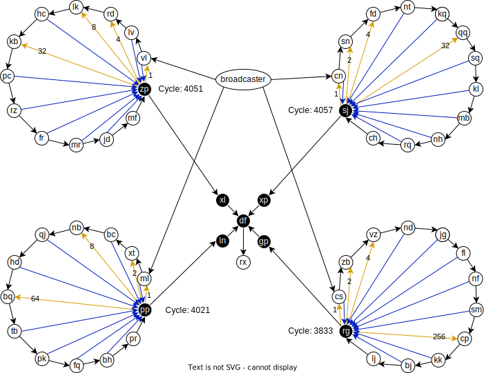

# 2023 Day 20

- [Solution by maneatingape](https://github.com/maneatingape/advent-of-code-rust/blob/main/src/year2023/day20.rs) (Rust)

## Benchmarks (i5-1240P, with parsing, no I/O)

- Part 1: `170.06 µs`
- Part 2: `745.45 µs`

## Explanation

